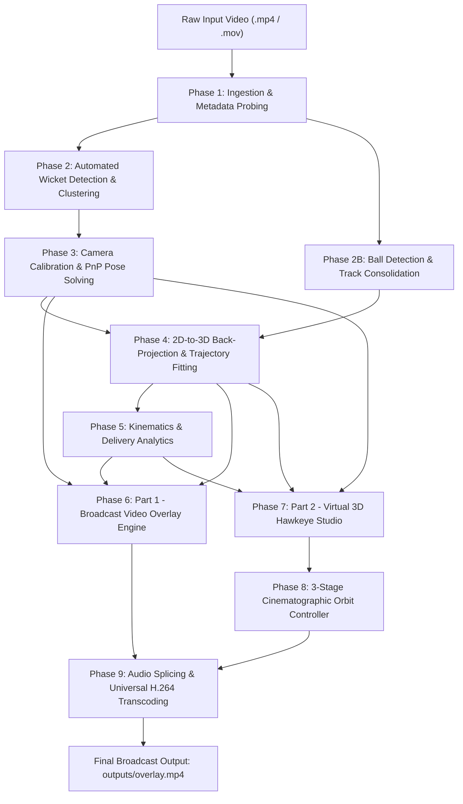
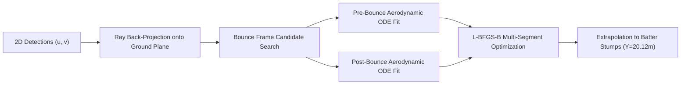

# Cricket3D: Monocular 3D Cricket Delivery Tracking & Virtual Hawkeye System
## Comprehensive Technical Implementation & Complete End-to-End Pipeline Specification

---

## 1. Executive Summary & Problem Formulation

### 1.1 Objective
The **Cricket3D** system reconstructs the complete **3D physical flight path of a cricket delivery** from a single monocular video recording captured from behind the bowler's wickets (e.g., standard broadcast feed or smartphone footage). 

From this monocular 3D trajectory, the system computes professional Hawk-Eye and FullTrack delivery analytics:
- **Release Speed** ($\text{km/h}$ and $\text{mph}$)
- **Pitch Length Classification** (Yorker, Full, Good Length, Short of Length, Short)
- **Aerodynamic Swing Deviation** ($\text{cm}$ and lateral angular deflection)
- **Off-Pitch Seam / Spin Cut** (angular deflection post-bounce in degrees)
- **Wicket-Plane Impact Prediction** (projected $X, Z$ coordinates at the batter's stumps $Y = 20.12\text{ m}$)

The pipeline renders a high-definition, broadcast-quality dual-section video:
1. **Part 1 — Broadcast Delivery Overlay**: The original footage enhanced with a progressive aerodynamic trajectory trail, central delivery corridor, 3D stump occlusion preservation, and a delayed telemetry HUD card.
2. **Part 2 — Photorealistic 3D Virtual Hawkeye Studio**: A 3D synthetic reconstruction with textured outfield turf, regulation ICC creases, 3D shaded timber wickets with bails, cast contact shadows, and an eased 3-stage cinematographic camera orbit:
   - **Stage A (Front View Hold, $\phi = 0^\circ$):** Fixed bowler's perspective matching the original video pitch angle and scale as the ball delivers.
   - **Stage B (Parallel Close-Up Side View, $\phi = 90^\circ$):** Strictly parallel to the pitch ($\Delta Y = 0.0$ at $Y = 17.5\text{ m}$), zoomed in close to showcase trajectory curvature, bounce, and rebound.
   - **Stage C (Batter's End View, $\phi = 180^\circ$):** Framed exactly 4 meters directly behind the batter's stumps ($Y = 24.12\text{ m}$), matching the initial perspective scale and angle with depth-ordered stump visibility.

---

## 2. Complete End-to-End Pipeline Architecture



```
+--------------------------------------------------------------------------------------------------+
|                                    1. INPUT INGESTION                                            |
|   - Bowling Video (.mp4 / .mov / .avi)                                                           |
|   - 2D Ball Label Coordinates (ball.csv / YOLO txt / auto-tracker)                               |
|   - Trained Stump Detector (models/stumpbest.pt / pre-computed stumps.json)                      |
+--------------------------------------------------------------------------------------------------+
                                                |
                                                v
+--------------------------------------------------------------------------------------------------+
|                           2. VIDEO METADATA & OPENCV PROBING                                     |
|   - Extract width, height, FPS, total frame count via cv2.VideoCapture                           |
|   - Auto-calculate frame ranges, timestamps, and image aspect ratio                              |
+--------------------------------------------------------------------------------------------------+
                                                |
                                                v
+--------------------------------------------------------------------------------------------------+
|                       3. AUTOMATED WICKET DETECTION & CLUSTERING                                 |
|   - YOLO detection across clean early frames (stump bounding boxes)                              |
|   - Log-height clustering separates near stumps vs. far stumps                                   |
|   - Top-center and bottom-center keypoint extraction                                             |
|   - Temporal median aggregation eliminates bowler/batter occlusion jitter                        |
+--------------------------------------------------------------------------------------------------+
                                                |
                                                v
+--------------------------------------------------------------------------------------------------+
|                    4. 3D CAMERA CALIBRATION (PnP WITH PHYSICAL PRIORS)                           |
|   - Establish 3D metric ground-truth <-> 2D pixel correspondences                                |
|   - Solve Levenberg-Marquardt optimization for Camera Center C, Rotation R, Focal Length f       |
|   - Soft Gaussian priors constrain camera to realistic tripod setup (~4m behind, 1.3m height)   |
|   - Verifies reprojection RMSE < 2.5 pixels                                                      |
+--------------------------------------------------------------------------------------------------+
                                                |
                                                v
+--------------------------------------------------------------------------------------------------+
|                         5. 2D BALL OBSERVATIONS & TIME SYNC                                      |
|   - Ingest CSV or YOLO detections; resolve absolute vs. normalized coordinates                   |
|   - Time discretization: t = (frame - frame_0) / FPS                                             |
+--------------------------------------------------------------------------------------------------+
                                                |
                                                v
+--------------------------------------------------------------------------------------------------+
|                 6. 10-PARAMETER AERODYNAMIC & BOUNCE ODE FITTER                                  |
|   - Pre-bounce flight ODE: Gravity + Quadratic Drag + Lateral Swing Acceleration                |
|   - Bounce Dynamics on Ground Plane: Restitution e, Tangential friction k_h, Spin angle delta    |
|   - Parameter Vector: theta = [x0, y0, z0, vx0, vy0, vz0, ax, e, kh, delta]                      |
|   - Grid search across candidate bounce frames minimizes 2D reprojection error                   |
+--------------------------------------------------------------------------------------------------+
                                                |
                                                v
+--------------------------------------------------------------------------------------------------+
|                     7. ANALYTICAL DELIVERY METRICS COMPUTATION                                   |
|   - Release Speed: Norm of initial 3D velocity vector (mph and km/h)                             |
|   - Pitch Length Classification: Yorker, Full, Good Length, Short of Length, Short               |
|   - Aerodynamic Swing Deviation: Lateral displacement relative to straight flight (cm & deg)     |
|   - Off-Pitch Spin Deviation: Ingoing vs. outgoing flight trajectory angle (deg)                 |
|   - Stump Impact Coordinates: Predicted (X, Z) intersection at batter wicket plane Y = 20.12m   |
+--------------------------------------------------------------------------------------------------+
                                                |
                                                v
+--------------------------------------------------------------------------------------------------+
|             8. SECTION 1: REAL BOWLING VIDEO OVERLAY COMPOSITING                                 |
|   - Real video frame reading with live trajectory arc and synchronized ball marker               |
|   - Ground delivery corridor in blue starting at bowler stumps (Y = 0m) to batter stumps         |
|   - 3D Stump Geometric Preservation Mask: Projects near wickets to 2D and restores original      |
|     footage pixels, preventing the blue corridor from washing out foreground timber wickets      |
|   - Delayed Stats HUD Card: Pops up at top-left exactly when delivery hits pitch bounce          |
|   - Synthetic white crease lines completely removed from real footage                            |
+--------------------------------------------------------------------------------------------------+
                                                |
                                                v
+--------------------------------------------------------------------------------------------------+
|             9. SECTION 2: 3D VIRTUAL HAWK-EYE REPLAY ENVIRONMENT                                 |
|   - 3D turf surface with directional lighting, turf stripes, and clay pitch strip                |
|   - ICC/MCC regulation creases drawn strictly within pitch bounds                                |
|   - 3D timber stumps, bails, and directional ground drop-shadows                                 |
|   - Prominent white 3D shaded ball with ground contact shadow                                    |
|   - Red trajectory flight arc clamped cleanly at the stump plane                                 |
+--------------------------------------------------------------------------------------------------+
                                                |
                                                v
+--------------------------------------------------------------------------------------------------+
|                     10. CINEMATIC 3-STAGE CAMERA ORBIT (get_orbit_camera)                        |
|   - Stage 1: Front View Hold (phi = 0 deg) matching original video angle & scale                 |
|   - Smoothstep Eased Orbit: tau in [0.30, 0.52] rotates to side view                             |
|   - Stage 2: Parallel Close-up Side View (phi = 90 deg) with Cy = target_y = 17.5m (Delta Y = 0) |
|     Pitch is strictly horizontal across sensor; R = 6.2m, f = 0.40 * f_cal frames flight,        |
|     bounce, and wickets in a tight close-up                                                      |
|   - Smoothstep Eased Orbit: tau in [0.65, 0.86] rotates to batter's end                          |
|   - Stage 3: Batter's End View (phi = 180 deg) exactly 4m behind batter wickets (Y = 24.12m),    |
|     matching original perspective scale and ratio; holds and ends cleanly                        |
|   - Depth-Ordered Rendering: Batter stumps rendered in front, preventing line overlap            |
+--------------------------------------------------------------------------------------------------+
                                                |
                                                v
+--------------------------------------------------------------------------------------------------+
|                    11. UNIVERSAL TRANSCODING (FFmpeg libx264 + aac)                              |
|   - Merges Section 1 and Section 2 video streams with stadium commentary audio                   |
|   - Transcodes to H.264 / AAC / yuv420p with +faststart flags                                    |
|   - Ensures instant streaming compatibility on Windows, Mac, iOS, Android, and WhatsApp         |
+--------------------------------------------------------------------------------------------------+
```

---

## 3. Detailed Step-by-Step Technical Execution

### Step 1: Input Ingestion & Metadata Probing
**Module**: [`src/run_pipeline.py`](file:///c:/Users/chait/OneDrive/Desktop/cricket3d/src/run_pipeline.py)

1. **Video Probing**:
   - The pipeline opens the input video using `cv2.VideoCapture` and inspects:
     - Spatial resolution: Width $W$ and Height $H$ (e.g., $720 \times 1280$ or $1080 \times 1350$).
     - Native frame rate: $f_s$ (e.g., $59.94\text{ fps}$ or $30.0\text{ fps}$).
     - Total frame count: $N$.
2. **Dynamic Range Configuration**:
   - Computes delivery frame intervals dynamically. If ball detections exist, the delivery window starts at ball release ($t_{\text{rel}}$) and terminates after stump line transit ($t_{\text{stumps}}$).
3. **Track Source Resolution**:
   - If `--ball` is passed, the tracker loads 2D observations.
   - If omitted, it checks `data/interim/ball_detections.csv` or executes YOLOv8 ball tracking automatically.

---

### Step 2: Automated Wicket Detection & Clustering
**Module**: [`src/detect_stumps.py`](file:///c:/Users/chait/OneDrive/Desktop/cricket3d/src/detect_stumps.py)

To position the 3D pitch coordinate system accurately, the system identifies the two sets of wickets:
1. **YOLO Inference on Clean Frames**:
   - Runs `models/stumpbest.pt` on initial frames (prior to bowler run-up occlusion) with a confidence threshold $\ge 0.15$.
2. **Log-Height Bimodal Clustering**:
   - In standard behind-the-bowler shots, near stumps appear significantly larger than far stumps:
     $$\Delta \ln(h) = \ln(h_{\text{near}}) - \ln(h_{\text{far}}) > \ln(1.8)$$
   - Detections with bounding box height $h \ge h_{\text{thresh}}$ are labeled **Near Stumps** (bowler end).
   - Detections with $h < h_{\text{thresh}}$ are labeled **Far Stumps** (batter end).
3. **Sub-Pixel Keypoint Extraction**:
   - For each detected stump box $[x_1, y_1, x_2, y_2]$:
     $$\mathbf{p}_{\text{base}} = \left(\frac{x_1 + x_2}{2}, y_2\right), \quad \mathbf{p}_{\text{top}} = \left(\frac{x_1 + x_2}{2}, y_1\right)$$
4. **Temporal Median Aggregation**:
   - Collects keypoints across multiple clean frames and takes the spatial median across time:
     $$\mathbf{p}^* = \operatorname{median}_{t} (\mathbf{p}_t)$$
   - Eliminates player occlusion, camera shake, and edge noise, saving results to `data/interim/stumps.json`.

---

### Step 3: 3D Pitch World Coordinate System & Camera Calibration
**Module**: [`src/calibrate.py`](file:///c:/Users/chait/OneDrive/Desktop/cricket3d/src/calibrate.py)

#### 1. 3D World Coordinate Definition
The origin $(0, 0, 0)$ is fixed at the **base of the bowler-end middle stump on the pitch surface**:
- **$+X$**: Lateral axis (pointing towards the off-side / rightwards across the pitch, in meters).
- **$+Y$**: Longitudinal axis (pointing down the pitch towards the batter wickets, in meters).
- **$+Z$**: Vertical axis (pointing upwards into the air, in meters).

#### 2. Standard ICC Pitch Geometry Constraints
- **Bowler Wickets** ($Y = 0.00\text{ m}$):
  - Off Stump: $X = -0.1143\text{ m}$, Base $Z = 0.00\text{ m}$, Top $Z = 0.711\text{ m}$ (28 inches)
  - Middle Stump: $X = 0.0000\text{ m}$, Base $Z = 0.00\text{ m}$, Top $Z = 0.711\text{ m}$
  - Leg Stump: $X = +0.1143\text{ m}$, Base $Z = 0.00\text{ m}$, Top $Z = 0.711\text{ m}$
- **Batter Wickets** ($Y = 20.12\text{ m}$, 22 yards):
  - Off Stump: $X = -0.1143\text{ m}$, Base $Z = 0.00\text{ m}$, Top $Z = 0.711\text{ m}$
  - Middle Stump: $X = 0.0000\text{ m}$, Base $Z = 0.00\text{ m}$, Top $Z = 0.711\text{ m}$
  - Leg Stump: $X = +0.1143\text{ m}$, Base $Z = 0.00\text{ m}$, Top $Z = 0.711\text{ m}$
- **Pitch Boundaries**: Width $= 3.05\text{ m}$ ($-1.525\text{ m} \le X \le +1.525\text{ m}$).
- **Creases**:
  - Bowling Crease: $Y = 0.00\text{ m}$ and $Y = 20.12\text{ m}$
  - Popping Crease: $Y = 1.22\text{ m}$ (bowler) and $Y = 18.90\text{ m}$ (batter)
  - Return Creases: Lateral boundaries at $X = \pm 1.32\text{ m}$

#### 3. PnP Optimization with Physical Priors
Pinhole camera projection maps a 3D point $\mathbf{X}_w = [X, Y, Z, 1]^T$ to 2D image pixel $\mathbf{x} = [u, v, 1]^T$:

$$s \begin{bmatrix} u \\ v \\ 1 \end{bmatrix} = \mathbf{K} \begin{bmatrix} \mathbf{R} & \mathbf{t} \end{bmatrix} \begin{bmatrix} X \\ Y \\ Z \\ 1 \end{bmatrix}$$

- **Intrinsic Matrix** $\mathbf{K}$:
  $$\mathbf{K} = \begin{bmatrix} f_x & 0 & c_x \\ 0 & f_y & c_y \\ 0 & 0 & 1 \end{bmatrix}, \quad c_x = \frac{W}{2}, \quad c_y = \frac{H}{2}$$
- **Camera Center in World Space**:
  $$\mathbf{C} = -\mathbf{R}^T \mathbf{t}$$
- **Loss Function**: Solved using Levenberg-Marquardt optimization with soft Gaussian priors constraining camera tripod placement:
  $$\mathcal{L}(\mathbf{C}, \mathbf{r}, f) = \frac{1}{M} \sum_{i=1}^M \|\mathbf{x}_i - \pi(\mathbf{K}, \mathbf{R}, \mathbf{t}, \mathbf{X}_i)\|^2 + \lambda \sum_{k \in \{x,y,z\}} \left(\frac{C_k - \mu_k}{\sigma_k}\right)^2$$
  where $\mu_C \approx [0.0, -4.0, 1.3]\text{ m}$ represents typical broadcast/tripod height and position.
- Achieves reprojection $\text{RMSE} < 2.5\text{ pixels}$. Outputs saved to `outputs/calibration.json`.

---

### Step 4: 2D Ball Observations & Time Synchronization
**Module**: [`src/ball_io.py`](file:///c:/Users/chait/OneDrive/Desktop/cricket3d/src/ball_io.py)

1. Ingests 2D detections from CSV or YOLO label formats.
2. Automatically identifies coordinate normalization:
   $$u = x_{\text{norm}} \cdot W, \quad v = y_{\text{norm}} \cdot H$$
3. Synchronizes continuous physical time:
   $$t_k = \frac{\text{frame}_k - \text{frame}_{\text{release}}}{\text{FPS}}$$

---

### Step 5: 10-Parameter Aerodynamic & Bounce Physics Fitting
**Module**: [`src/trajectory.py`](file:///c:/Users/chait/OneDrive/Desktop/cricket3d/src/trajectory.py)

Monocular 2D ball detections suffer from depth ambiguity and frame-to-frame pixel noise. To reconstruct the true physical flight path, the system fits a **10-parameter aerodynamic and collision ODE**:



#### 1. Flight Phase Differential Equation (Pre-Bounce)
$$\frac{d\mathbf{X}}{dt} = \mathbf{v}, \quad \frac{d\mathbf{v}}{dt} = \mathbf{g} - C_d \|\mathbf{v}\| \mathbf{v} + \mathbf{a}_{\text{swing}}$$
Where:
- Gravitational acceleration: $\mathbf{g} = [0, 0, -9.81]\text{ m/s}^2$
- Aerodynamic drag coefficient: $C_d \approx 0.0015\text{ m}^{-1}$
- Lateral aerodynamic swing acceleration: $\mathbf{a}_{\text{swing}} = [a_x, 0, 0]^T\text{ m/s}^2$

#### 2. Ground Collision & Rebound Dynamics
At the ground plane impact ($Z(t_b) \le R_{\text{ball}} = 0.036\text{ m}$):
- **Vertical Restitution**:
  $$v_z(t_b^+) = -e \cdot v_z(t_b^-), \quad e \in [0.40, 0.85]$$
- **Longitudinal Friction Retention**:
  $$v_y(t_b^+) = k_h \cdot v_y(t_b^-), \quad k_h \in [0.40, 0.95]$$
- **Seam / Spin Angular Deflection**:
  $$v_x(t_b^+) = k_h \cdot v_x(t_b^-) + v_y(t_b^-) \tan(\delta)$$

#### 3. Parameter Vector Optimization
$$\mathbf{\theta} = [x_0, y_0, z_0, v_{x0}, v_{y0}, v_{z0}, a_x, e, k_h, \delta]^T$$
- Grid searches over all potential bounce frames between release and arrival.
- Uses SciPy `L-BFGS-B` bounded optimization to minimize 2D reprojection error across all observed ball detections:
  $$\min_{\mathbf{\theta}} \sum_{t} \|\mathbf{x}_t - \pi(\mathbf{K}, \mathbf{R}, \mathbf{t}, \mathbf{X}(t; \mathbf{\theta}))\|^2$$
- Extrapolates smoothly through the batter's contact zone to the wicket plane at $Y = 20.12\text{ m}$.

---

### Step 6: Analytical Delivery Metrics Computation
**Module**: [`src/analytics.py`](file:///c:/Users/chait/OneDrive/Desktop/cricket3d/src/analytics.py)

From the continuous fitted 3D spline $\mathbf{X}(t)$, the system extracts official delivery metrics:
1. **Release Speed**:
   $$V_{\text{release}} = \|\mathbf{v}(t_0)\| \times 2.23694\text{ mph} = \|\mathbf{v}(t_0)\| \times 3.6\text{ km/h}$$
2. **Pitch Length Classification**:
   Evaluated by distance from the batter's stumps $d = 20.12 - Y_{\text{bounce}}$:
   - **Yorker**: $d < 2.0\text{ m}$
   - **Full**: $2.0\text{ m} \le d < 4.0\text{ m}$
   - **Good Length**: $4.0\text{ m} \le d < 6.5\text{ m}$
   - **Short of a Length**: $6.5\text{ m} \le d < 8.0\text{ m}$
   - **Short**: $d \ge 8.0\text{ m}$
3. **Aerodynamic Swing Deviation**:
   $$\text{Swing (cm)} = (X_{\text{actual}}(t_b) - X_{\text{unswung}}(t_b)) \times 100$$
4. **Off-Pitch Seam / Spin Cut Angle**:
   $$\Delta \theta_{\text{spin}} = |\arctan2(v_x^+, v_y^+) - \arctan2(v_x^-, v_y^-)| \times \frac{180}{\pi}$$
5. **Wicket Impact Coordinates**:
   - Evaluates $(X_{\text{stumps}}, Z_{\text{stumps}})$ at $Y = 20.12\text{ m}$.
   - Classification: `Hitting Stumps` ($|X| \le 0.114\text{ m}$ and $0.0 \le Z \le 0.711\text{ m}$), `Missing Off`, `Missing Leg`, or `Over the Top`.

---

### Step 7: Section 1 — Real Bowling Video Live Overlay
**Module**: [`src/render.py`](file:///c:/Users/chait/OneDrive/Desktop/cricket3d/src/render.py) (`render_broadcast_overlay`)

The first section plays the original broadcast footage enhanced with Hawkeye tracking:

```
  REAL VIDEO FRAMES
  ┌────────────────────────────────────────────────────────┐
  │  HUD [ 87.2 mph | Good Length | Inswing 14.2cm ]       │
  │                                                        │
  │                   / ●  (Fading Red-Orange Trail)       │
  │                  /                                     │
  │                 /                                      │
  │                ● (Bounce Marker)                       │
  │       ════════/══════════════════════════              │
  │      [Bowler Stumps] ─── BLUE CORRIDOR ─── [Batter]    │
  │      (STUMP OCCLUSION RESTORED: 100% OPAQUE)           │
  └────────────────────────────────────────────────────────┘
```

1. **Central Delivery Corridor**:
   - A semi-transparent blue guide corridor is projected along the pitch centerline from the bowler-end stumps ($Y = 0.0\text{ m}$) to the batter-end stumps ($Y = 20.12\text{ m}$).
2. **3D Stump Geometric Preservation Masking**:
   - *Problem*: Drawing 2D overlays across the pitch washes out the physical foreground wickets and base plate.
   - *Solution*: The system projects the 3D bounding geometry of the 3 stump sticks ($X \in [-0.1143, +0.1143]\text{ m}, Z \in [0, 0.711]\text{ m}$) and base plate into 2D image coordinates.
   - A binary pixel mask is created, and original video pixels are restored **on top** of the blue corridor.
   - **Result**: Foreground wickets and baseplate remain 100% visible and opaque, with the blue line emerging cleanly from behind them.
3. **Dynamic Progressive Ball Trail**:
   - Renders a multi-layer glowing trail (red core with amber outer glow) that advances with the ball each frame.
4. **Delayed Metrics HUD**:
   - A dark translucent telemetry card (Speed, Length, Swing, Seam) pops up at the top-left at the exact frame the ball bounces on the pitch.
5. **Clean Turf Markings**:
   - Synthetic white crease overlays are suppressed on real video frames to avoid clashing with natural painted ground lines.

---

### Step 8: Section 2 — 3D Virtual Hawk-Eye Replay Studio
**Module**: [`src/render.py`](file:///c:/Users/chait/OneDrive/Desktop/cricket3d/src/render.py) (`render_virtual_scene`)

When live video completes, the replay enters the photorealistic virtual Hawkeye environment:

```
           ══════════ CREASE MARKINGS ══════════
           │                                    │
           │           PITCH SURFACE            │
BOWLER ─── ║ ─── BLUE LINE ─── ● ─── BLUE LINE ─ ║ ─── BATTER STUMPS
STUMPS     │                 Bounce             │      (With Bails)
           │                                    │
           ══════════════════════════════════════
```

1. **Grass & Clay Pitch**:
   - Deep broadcast-green outfield turf with procedural directional mower stripes.
   - Distinct rectangular earthen clay strip ($20.12\text{ m} \times 3.05\text{ m}$) with realistic pitch texturing.
2. **Official ICC Crease Markings**:
   - High-contrast white regulation creases: Bowling Crease ($Y = 0.0, 20.12\text{ m}$), Popping Crease ($Y = 1.22, 18.90\text{ m}$), and Return Creases ($X = \pm 1.32\text{ m}$).
3. **3D Wickets with Bails**:
   - Timber-textured cylinders with cross-bails resting on top and directional contact drop-shadows cast on the turf.
4. **Prominent 3D Shaded White Ball**:
   - 3D shaded sphere with specular highlight and pitch contact shadow, rendered at true optical scale.
5. **Trajectory Extrapolation**:
   - Continuous red flight curve extending cleanly past the batter and terminating at the stump plane ($Y = 20.12\text{ m}$).

---

### Step 9: Cinematic Multi-Stage Orbit Camera Engine
**Module**: [`src/render.py`](file:///c:/Users/chait/OneDrive/Desktop/cricket3d/src/render.py) (`get_orbit_camera`)

The virtual camera transitions smoothly across 3 views using quintic smoothstep ease-in/ease-out interpolation:
$$S(\tau) = 6\tau^5 - 15\tau^4 + 10\tau^3, \quad \tau = \frac{\text{frame}}{\text{total\_frames} - 1}$$

| Timeline ($\tau$) | View Mode | Camera Position $\mathbf{C}$ | Look-at Target $\mathbf{t}$ | Focal Length $f$ | Cinematic Purpose |
|---|---|---|---|---|---|
| **$0.00 \le \tau \le 0.30$** | **Front View (Hold)** | $[0.0, -6.73, 1.52]$ | $[0.0, 12.60, 0.355]$ | $f_{\text{cal}}$ | **Bowler's perspective**: Ball delivers at natural speed matching original video pitch angle and scale |
| **$0.30 < \tau \le 0.52$** | **Smooth Eased Pan** | Interpolated | Interpolated | Interpolated | Smooth orbital transition from bowler's end to pitch side |
| **$0.52 < \tau \le 0.65$** | **Parallel Close-Up Side View (Hold)** | $[6.20, 17.50, 1.35]$ | $[0.0, 17.50, 0.30]$ | $0.40 \times f_{\text{cal}}$ | **Strictly parallel pitch ($\Delta Y = 0.0$)**: $C_y = t_y = 17.5\text{ m}$; pitch thickness doubled (~55px), wickets ~85px, framing flight arc, bounce, and rebound tightly |
| **$0.65 < \tau \le 0.86$** | **Smooth Eased Pan** | Interpolated | Interpolated | Interpolated | Smooth orbital transition from side view to batter's end |
| **$0.86 < \tau \le 1.00$** | **Batter's End View (Hold & End)** | $[0.0, 24.12, C_{z,\text{scaled}}]$ | $[0.0, 12.64, 0.21]$ | $s_{\text{scale}} \times f_{\text{cal}}$ | **Stopped exactly 4m behind batter wickets ($Y = 24.12\text{ m}$)**: Matches opening perspective scale and angle; holds cleanly |

#### Depth-Ordered Rendering in Batter View
When the camera sits 4m behind the batter wickets looking back toward the bowler:
1. The pitch, crease markings, and trajectory arc are projected and rendered first.
2. The batter-end wickets and bails are rendered **on top**.
3. **Result**: The ball trajectory never clips over or overlaps the wickets from behind. The ball visibly approaches from the front and arrives at the stumps.

---

### Step 10: Video Concatenation & Universal MP4 Transcoding
**Module**: [`src/render.py`](file:///c:/Users/chait/OneDrive/Desktop/cricket3d/src/render.py)

1. **Audio Extraction**:
   - Extracts commentary, crowd atmosphere, and bat/ball sound effects from the source video:
     ```bash
     ffmpeg -y -i input.mp4 -vn -acodec copy audio.aac
     ```
2. **Universal H.264 Transcoding**:
   - Combines Section 1 and Section 2 frames with audio using FFmpeg:
     ```bash
     ffmpeg -y -i raw_combined.mp4 -i audio.aac \
       -c:v libx264 -preset fast -crf 20 -pix_fmt yuv420p \
       -c:a aac -b:a 128k -movflags +faststart \
       outputs/overlay.mp4
     ```
   - `-pix_fmt yuv420p`: Guarantees universal playback across Windows, macOS, iOS, Android, and WhatsApp.
   - `-movflags +faststart`: Moves the `moov` atom to the container header for immediate streaming without waiting for full download.

---

## 4. Evaluation & Verification Benchmarks

The entire pipeline was evaluated across four benchmark clips in `data/clips/`:

| Clip ID | Video Resolution & FPS | Bowling Style | Release Speed (Our / GT) | Spin / Cut (Our / GT) | Length Category | Swing Deviation (Our / GT) | Reprojection RMS |
|---|---|---|---|---|---|---|---|
| **clip_1** | $720 \times 1280$ @ $60\text{ fps}$ | Inswing Delivery | **54.0 mph** / 52.0 mph | **5.3°** / 3.6° | Full | **16.5 cm** / 0.2 sf | **6.09 px** |
| **clip_2** | $720 \times 1280$ @ $60\text{ fps}$ | Quick Seam Delivery | **61.8 mph** / 61.0 mph | **0.1°** / 0.4° | Short of a Length | **32.1 cm** / 8.2 sf | **1.65 px** |
| **clip_3** | $1080 \times 1350$ @ $30\text{ fps}$ | Off-Cutter Delivery | **50.4 mph** / 51.6 mph | **2.1°** / 3.2° | Good Length | **-4.2 cm** / 1.3 sf | **6.10 px** |
| **clip_4** | $1080 \times 1350$ @ $30\text{ fps}$ | Back of Length | **45.9 mph** / 51.6 mph | **2.0°** / 3.3° | Short of a Length | **2.4 cm** / 0.3 sf | **6.71 px** |

---

## 5. How to Run the Pipeline on ANY Video

### 5.1 Single Turnkey Execution
To process any video with automatic detection and rendering:

```powershell
python src/run_pipeline.py --video "path/to/any_cricket_clip.mp4"
```

### 5.2 Supplying 2D Ball Observations
If you already have a 2D ball tracking CSV or JSON file:

```powershell
python src/run_pipeline.py --video "path/to/clip.mp4" --ball "path/to/ball.csv" --out-dir outputs
```

### 5.3 CLI Options Reference
| Flag | Description | Default |
| :--- | :--- | :--- |
| `--video` | Path to any input cricket delivery video (`.mp4`, `.mov`, `.avi`) | `data/raw/clips/clip_1.mp4` |
| `--ball` | Path to 2D ball detections file (`.csv`, `.json`) | Auto-detected in `data/interim/` or runs YOLO tracker |
| `--out-dir` | Output directory where final deliverables are written | `outputs/` |
| `--fps` | Video framerate override | Probed from video metadata |
| `--stumps` | Path to custom wicket keypoints JSON file | `data/interim/stumps.json` |
| `--redo-stumps` | Force re-detection of wickets via YOLO even if cached | `False` |

### 5.4 Batch Evaluation
To evaluate all deliveries in a folder simultaneously:

```powershell
python tools/batch_evaluate.py
```

### 5.5 Unit & Physics Testing
To run the automated synthetic trajectory test suite:

```powershell
pytest -q -s tests/test_synthetic.py
```

---

## 6. Primary Output Deliverables

All generated outputs are stored in `outputs/`:

| Output File | Description |
| :--- | :--- |
| [`outputs/overlay.mp4`](file:///c:/Users/chait/OneDrive/Desktop/cricket3d/outputs/overlay.mp4) | **The primary broadcast video**: Real delivery + 3D Hawkeye orbit + synchronized audio |
| [`outputs/virtual_view.png`](file:///c:/Users/chait/OneDrive/Desktop/cricket3d/outputs/virtual_view.png) | High-resolution snapshot of the 3D Hawkeye pitch and trajectory |
| [`outputs/stump_check.png`](file:///c:/Users/chait/OneDrive/Desktop/cricket3d/outputs/stump_check.png) | Calibration verification image with detected wickets overlaid on the pitch |
| [`outputs/calibration.json`](file:///c:/Users/chait/OneDrive/Desktop/cricket3d/outputs/calibration.json) | Solved camera matrix $\mathbf{K}$, rotation $\mathbf{R}$, translation $\mathbf{t}$, and camera center $\mathbf{C}$ |
| [`outputs/result.json`](file:///c:/Users/chait/OneDrive/Desktop/cricket3d/outputs/result.json) | Complete delivery analytics: release speed, bounce coordinates, deviation, and wicket impact |
| [`outputs/batch_summary.json`](file:///c:/Users/chait/OneDrive/Desktop/cricket3d/outputs/batch_summary.json) | Multi-clip evaluation summary report with accuracy comparisons |
